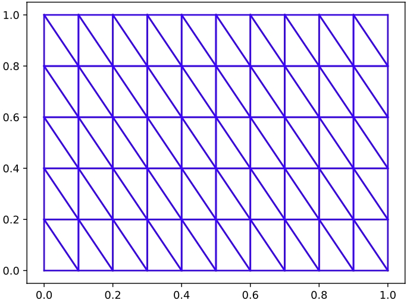

# Enunciado del Problema

Durante este semestre trabajaremos en la solución numérica de la ecuación de   advección–difusión–reacción en un dominio rectangular 2D:

```math
\frac{\partial c}{\partial t} + A[c](t,x,y) = f(t,x,y),
\quad
A[c] = \mathbf{V}(t,x,y)\cdot\nabla c - D\Delta c + \kappa\,c
```

con \$(t,x,y)\in [0,T]\times [0,L_{x}]\times [0,L_{y}]\$.

Con condiciones de contorno Dirichlet homogéneas:

```math
c(t,x,y) = 0 \quad (t, x, y) \in \partial([0,L_{x}]\times[0,L_{y}]), \forall t\in[0,T]
```

Condición inicial:

```math
c(0,x,y) = c_0(x,y)
```
donde $D,\kappa\in\mathbb{R}$ y $\mathbf{V},f,c_0$ son funciones dadas.  

El trabajo se divide en dos etapas:  
1. Implementar un método apropiado de **Diferencias Finitas** y presentar resultados.  
2. Implementar el método de **Elementos Finitos**, con polinomios de orden $1$ con la triangulación que aparece en la siguiente figura:



