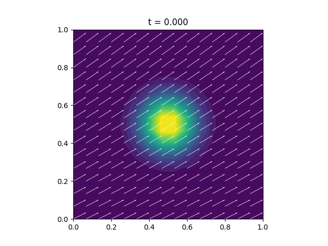

# Resultados del Método de Diferencias Finitas

**Condición inicial**  
Para todos los casos la condición inicial es el pulso gaussiano  
```math
    u(x,y,0) = exp(-50·((x−0.5)^{2} + (y−0.5)^{2}))
```
discretizado con diferencias finitas y evolucionado con el θ–method (θ=0.5, Crank–Nicolson).

---

## Caso 1: Sin difusión  
**Parámetros**  
- D = 0  
- k = 0.5  
- f = 0  
- Vx = 1.0 + 0.5 sin(2π t/Tfin) X  
- Vy = 0.5 + 0.25 cos(2π t/Tfin) Y  



**Conclusión**  
Al anular D, el término de difusión desaparece y la solución se transporta prácticamente sin cambio de forma: el pico de la gaussiana mantiene su altura mientras se desplaza, salvo pequeñas pérdidas en los bordes impuestas por las condiciones de contorno Dirichlet.

---

## Caso 2: Difusión moderada  
**Parámetros**  
- D = 0.5  
- k = 0.5  
- f = 0  
- Vx = 1.0 + 0.5 sin(2π t/Tfin) X  
- Vy = 0.5 + 0.25 cos(2π t/Tfin) Y  


**Conclusión**  
Con D=0.5 la difusión suaviza rápidamente la curva: los gradientes se atenúan, la cresta se aplana y la anchura de la gaussiana aumenta, demostrando el papel disipativo del término Δu en el esquema de diferencias finitas.

---

## Caso 3: Reacción fuerte  
**Parámetros**  
- D = 0.5  
- k = 100  
- f = 0  
- Vx = 1.0 + 0.5 sin(2π t/Tfin) X  
- Vy = 0.5 + 0.25 cos(2π t/Tfin) Y  


**Conclusión**  
Al aumentar k a 100, el término de reacción domina y provoca una aniquilación rápida de la onda: la amplitud decae casi instantáneamente, mostrando el carácter fuertemente disipativo de –k u en la EDP.

---

## Caso 4: Fuente activada  
**Parámetros**  
- D = 0.5  
- k = 0.5  
- f(t,x,y) = (1 + t) sin(πx) sin(πy)  
- Vx = 1.0 + 0.5 sin(2π t/Tfin) X  
- Vy = 0.5 + 0.25 cos(2π t/Tfin) Y  


**Conclusión**  
Con la fuente no homogénea, la solución crece en las zonas de inyección (\(\sinπx\sinπy\)) y luego alcanza un estado pseudo–estacionario donde producción y disipación (difusión+reacción) se equilibran, mostrando un perfil espacial similar al de la fuente.

---

## Caso 5: Campo constante  
**Parámetros**  
- D = 0.5  
- k = 0.5  
- f = 0  
- Vx = 1.0 (constante)  
- Vy = 0.01 (constante)  


**Conclusión**  
Con velocidades constantes la onda se desplaza uniformemente hacia la derecha y arriba. La difusión D=0.5 sigue aplanando la cresta, pero al no haber variación temporal o espacial en Vx/Vy la traslación es lineal y más predecible.

---

**Comentarios generales sobre el método de diferencias finitas**  
- El esquema θ (θ=0.5) garantiza estabilidad y segunda orden en tiempo cuando Δt y Δx cumplen la CFL.  
- El término de difusión suaviza las oscilaciones numéricas y modela correctamente la disipación.  
- La reacción –k u actúa como amortiguador global de la solución.  
- La fuente añade masa al sistema de manera controlada, permitiendo estudiar equilibrio producción–pérdida.
