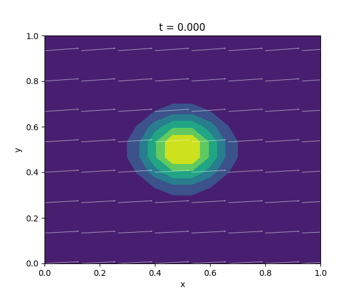

# Resultados del Método de Diferencias Finitas

En esta sección se muestran cinco casos de prueba, variando los parámetros de difusión, reacción, fuente y velocidad.

---

## Caso 1: Sin difusión

**Parámetros**  
- D = 0  
- k = 0.5  
- f = 0  
- Vx = 1.0 + 0.5·sin(2πt/Tfin)·X
- Vy = 0.5 + 0.25·cos(2πt/Tfin)·Y  

**Conclusión**  
La ecuación sólo transporta la onda. La cresta mantiene su forma original y sólo baja un poco de altura al llegar a los bordes (donde u = 0).

---

## Caso 2: Difusión moderada

**Parámetros**  
- D = 0.5  
- k = 0.5  
- f = 0  
- mismo campo variable de velocidad  

**Conclusión**  
Con D = 0.5 la onda se va aplanando: los bordes se redondean y el pico baja más rápido.

---

## Caso 3: Reacción fuerte

**Parámetros**  
- D = 0.5  
- k = 100
- f = 0  
- mismo campo variable de velocidad  

**Conclusión**  
Con k = 100 la onda desaparece casi de inmediato: la amplitud cae drásticamente y no alcanza a desplazarse.

---

## Caso 4: Fuente activada

**Parámetros**  
- D = 0.5  
- k = 0.5  
- f(t,x,y) = (1 + t)·sin(πx)·sin(πy)  
- mismo campo variable de velocidad  

**Conclusión**  
La onda crece y luego se estabiliza en un perfil similar a la función fuente; hay un equilibrio entre producción y disipación.

---

## Caso 5: Campo constante

**Parámetros**  
- D = 0.5  
- k = 0.5  
- f = 0  
- Vx = 1 (constante), Vy = 0.01 (constante)  

**Conclusión**  
La onda se desplaza uniformemente hacia la derecha; con D = 0.5 la cresta se alisa ligeramente.
