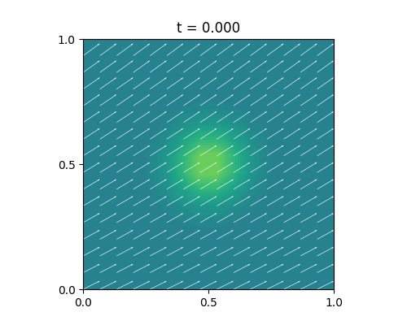

# Resultados del Método de Elementos Finitos

**Condición inicial**  
Para todos los casos la condición inicial es el pulso gaussiano
```math
    u(x,y,0) = exp(-50·((x−0.5)^{2} + (y−0.5)^{2}))
```
discretizado con elementos finitos P1 sobre malla triangular y tiempo integrado con θ-method (θ = 0.5, Crank–Nicolson).

---

## Caso 1: Sin difusión  
**Parámetros**  
- D = 0  
- k = 0.5  
- f = 0  
- Vx = 1.0 + 0.5 sin(2π t/Tfin) X  
- Vy = 0.5 + 0.25 cos(2π t/Tfin) Y  



**Conclusión**  
Con D=0, el esquema FEM transporta la gaussiana sin cambiar su forma ni anchura. Sólo pierde un poco de altura al tocar los bordes, por las condiciones de contorno.


---

## Caso 2: Difusión moderada  
**Parámetros**  
- D = 0.5  
- k = 0.5  
- f = 0  
- Vx = 1.0 + 0.5 sin(2π t/Tfin) X  
- Vy = 0.5 + 0.25 cos(2π t/Tfin) Y  


**Conclusión**  


Con D=0.5 la difusión hace que la gaussiana se “extienda”: la cresta se aplana y el pulso se hace más ancho con el tiempo, mostrando el efecto disipativo del término Δu.

---

## Caso 3: Reacción fuerte  
**Parámetros**  
- D = 0.5  
- k = 100  
- f = 0  
- Vx = 1.0 + 0.5 sin(2π t/Tfin) X  
- Vy = 0.5 + 0.25 cos(2π t/Tfin) Y  


**Conclusión**  
Al aumentar k a 100, el término de reacción “absorbe” la gaussiana casi de inmediato: la amplitud cae rápidamente y la curva desaparece casi por completo.

---

## Caso 4: Fuente activada  
**Parámetros**  
- D = 0.5  
- k = 0.5  
- f(t,x,y) = (1 + t) sin(πx) sin(πy)  
- Vx = 1.0 + 0.5 sin(2π t/Tfin) X  
- Vy = 0.5 + 0.25 cos(2π t/Tfin) Y  


**Conclusión**  
Con la fuente no homogénea, la fuente introduce energía en el centro del dominio. Al principio la onda crece ahí, luego la difusión y la reacción equilibran la producción y se forma un perfil casi estable parecido a la función fuente.

---

## Caso 5: Campo constante  
**Parámetros**  
- D = 0.5  
- k = 0.5  
- f = 0  
- Vx = 1.0 (constante)  
- Vy = 0.5 (constante)  


**Conclusión**  
Con velocidades constantes la onda se desplaza de manera uniforme sin deformarse por variaciones del campo. La difusión sigue aplanando la cresta, pero el movimiento es lineal y predecible.

---

**Comentarios generales sobre el método de diferencias finitas**  
- El método θ (θ=0.5) combina estabilidad y precisión de segundo orden en el tiempo.  
- La difusión (D) controla cuánto se dispersa el pulso.  
- La reacción (k) regula la velocidad de amortiguación de la solución.  
- La fuente añade o retira energía según su forma.  
- Comparado con diferencias finitas, FEM con elementos P1 en malla triangular ofrece soluciones suaves y sin sesgo direccional, aunque ambos métodos muestran resultados muy parecidos en este dominio rectangular.  
